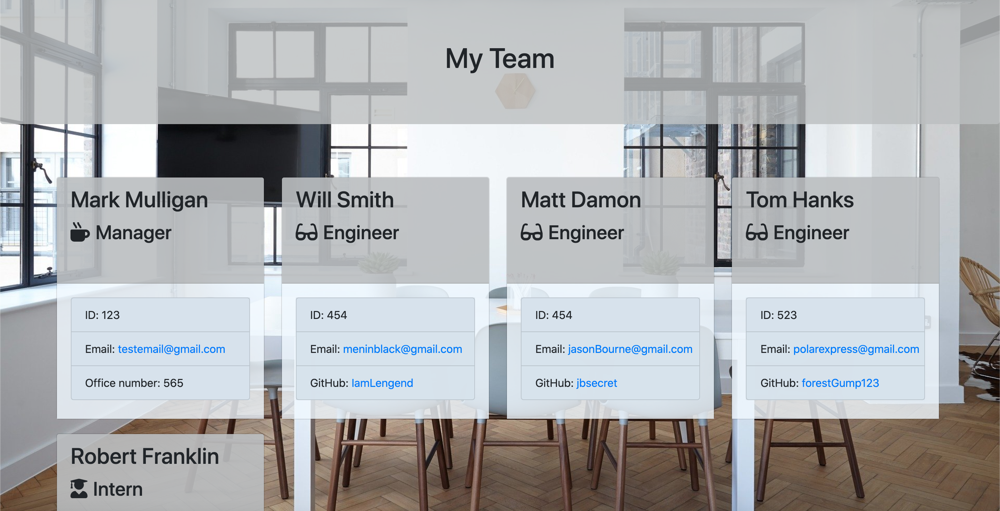

# Employee Roster Generator

[](https://opensource.org/licenses/Apache-2.0)

## Description 
This project was built using node.js and includes the npm package inquirer to allow the user to interact with the program via the commandline. The goal of this project was to allow the user to generate a html page that displays information about all the employees that work for a company.  The program generates a new file that is already formated and includes all the data the user inputed.  

## Table of Contents
  
* [Installation](#installation)
* [Usage](#usage)
* [Walkthrough](#walkthrough)
* [Tests](#tests)
* [License](#license)
* [Questions](#questions)
  
  
## Installation
** This project requires node.js so make sure that is installed on your system before doing anything else. **

* Step 1: Navigate to the directory you want to store the project. Clone this your repository to your local computer using the command below. 
```bash
git clone https://github.com/MarkMulligan97/readmeGenerator.git
```

* Step 2: Use the command line to navigate to the directory that you cloned the project.
Example:
```bash
cd Desktop/readmeGenerator
```

* Step 3: Install npm in the project directory.
```bash
npm init
```

* Step 4: Install the npm package dependencies from the package.json file.
```bash
npm install
```

* Step 5: While in the project directory, run the program using node using the command below.
```bash
node app.js
```
## Usage 
After installing the project and all the required npm packages, run the project in your command line.  Make sure to be in the project directory.
```bash
node app.js
```
1.  Answer all the questions that are prompted to you in the command line.  
2.  After all the questions have been answered, a team.html file will be generated in the output folder.
3.  Also included in the output folder is an assets folder that contains all the css and images that go along with the generated html page.



## Walkthrough 
[Video Demo](https://www.youtube.com/watch?v=j_06LvDGsUg&feature=youtu.be)

Example Readme generated using this project:
[click here](./output/team.html)

## Tests
Tests for this project are included in the test folder.  These tests are desigened to make sure all the classes are working properly.  

* To run the tests, make sure jest is installed using npm.
* Run npm run test
```bash
node npm run test
```

## License
This project is liscensed under an Apache license.

For more info, checkout this link:
https://opensource.org/licenses/Apache-2.0

## Questions
[My Github](https://github.com/MarkMulligan97) || mark.mulligan.jr1@gmail.com

#### How to Contact Me
Feel free to reach out to me if you have any questions about this project.  You can email me using the email listed above or can go to my github page to view my other projects and portfolio.

© Mark Mulligan 2020 All Rights Reserved.